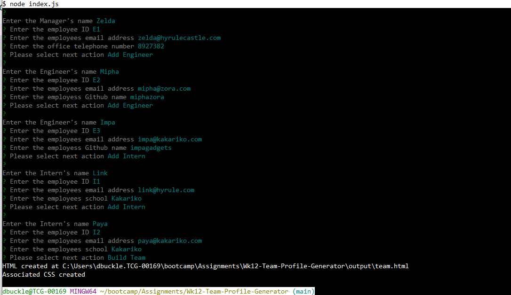
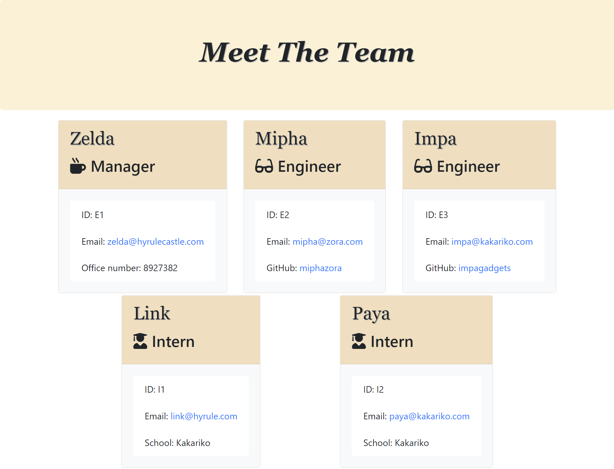

# Generate Team Profile

## Description
This app allows the user to enter details about their team.  Once complete an HTML page will be created displaying the entered information.

## Table of Contents
* [Links](#links)
* [Installation](#installation)
* [Usage](#usage)
* [Screenshots](#screenshots)
* [Project Items](#project-items)
* [License](#license)
* [Features](#features)

## Links
* [Repo](https://github.com/cadbuckle/genTeamProfile)

## Installation
If not already installed, please install node.  
From the root of the app, please run "npm i" to install any additional required packages

## Usage
From a bash prompt, enter the command "node index.js"
The screen will initially prompt for the details of the team manager.
A menu will then be displayed that allows the user to enter details for engineers and interns that are on the team.
When this is complete, the user can then select the "build the team" option.
An HTML file (team.html) will then be created in the "output" folder. The output folder, is not already existing, will be created in the current folder.

## Screenshots
### Showing the prompts and entered data
</img>
### Showing generated HTML page
</img>

## License
MIT License

## Features
JavaScript, Node and Jest notably:
* Classes and class extension
* Node to allow the running of this via the command line
* Use of Inquirer package to prompt the user for the various details
* Jest to perform the tests against the class objects that are defined.
* FS and Path packages for directory and file manipulation

## Contributions
Please email me with details if you wish to contribute further to this app

## Tests
### Manual Tests
* Not enter a field - all fields are required
* Telephone number is numeric - reject anything that's not a number
### Automated Tests
Jest is used to run tests against the following objects
* Employee - base object
* Manager - extends Employee
* Engineer - extends Employee
* Intern - extends Employee

## Acknowledgements
Thanks to:
* Bootcamp Lessons

## Questions?
My github profile can be found at https://github.com/cadbuckle
If you wish to contact me, you can email me at duncan.buckle@gmail.com

© 2024 edX Boot Camps LLC. Confidential and Proprietary. All Rights Reserved.